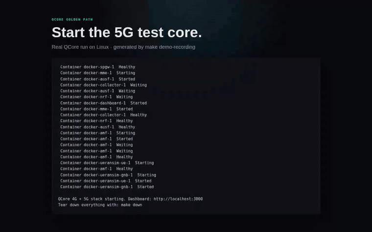

# QCore

[](https://github.com/umairsuperhero/qcore/actions/workflows/ci.yml)

**The open-source 4G/5G core network that's actually easy to use.**

<p align="center">
  
</p>

<p align="center">
  <sub>Generated from a real GitHub Actions Linux run via <code>make demo-recording</code>:
  <a href="https://github.com/umairsuperhero/qcore/actions/runs/28811067742">run 28811067742</a>.
  Shows QCore's bundled dashboard/simulator path; broader real-RAN compatibility remains evidence-gated.</sub>
</p>

> Updated: 2026-07-08

QCore is a development and test environment for cellular networks — **not** a 5G core competing on protocol features. Primary user: the RAN/device developer who needs a core to test against. QCore wins on experience: fast start, deep observability, and AI that explains failures.

See the [Product Experience Charter](docs/experience-charter.md) for the full vision, persona, and North Star. **Read it before any product or design work.**

---

## Help test QCore

QCore is ready for external cold runs. We are looking for RAN/device developers,
researchers, and telecom engineers who can spend about 15 minutes trying the
golden path and telling us where it becomes confusing or breaks.

- **Simulator-only:** follow [`docs/try-qcore.md`](docs/try-qcore.md).
- **Your own gNB, UE, eNB, or srsRAN:** follow
  [`docs/try-qcore-real-ran.md`](docs/try-qcore-real-ran.md).
- **Report a run or failure:** use the
  [evidence-first issue forms](https://github.com/umairsuperhero/qcore/issues/new/choose).

The useful result is not necessarily "it worked." A captured failure, the time it
took to understand it, and one honest sentence about whether QCore saved time are
exactly the evidence we need.

---

## Project Status

| Track | What shipped | Status |
|-------|-------------|--------|
| 4G EPC | HSS (subscriber management + Milenage), MME (S1AP/NAS attach, auth, security mode), SPGW (GTP-U, S11, Linux TUN egress). End-to-end attach + uplink verified. | ✅ Shipped |
| Phase A — Event model | `pkg/events` structured event schema, journey-ID correlation, HTTP emitter. `cmd/qcore-collector` SSE stream + journey store. All 4G NFs instrumented. | ✅ Shipped |
| Phase B — Golden Path | `make up` one-command launch. Web dashboard (port 3000): health view, subscriber management, live event trace, RAN-connect config panel. Built-in S1AP/NAS simulator with 4 error-injection scenarios. | ✅ Shipped |
| 5G SA Track | AMF/AUSF/UDM/UDR/NRF/SMF/UPF + PFCP/N4 codec all built. Control **and** user plane pass an in-process E2E test (Registration → PDU session → GTP-U tunnel). Interop hardening, 5G Phase-A telemetry, and **T10/UERANSIM real-RAN validation for the bundled Docker/cloud-Linux profile are shipped**: native SCTP, registration, PDU session establishment, NGAP PDU Session Resource Setup, PFCP remote tunnel update, UPF real TUN/NAT, and UE ping over `uesimtun0` all pass against real UERANSIM. **5G AUTS/SQN resynchronization is interop-validated**: a real UERANSIM UE forced a Synch failure (SQN out of range), QCore recovered SQN_MS via reverse-Milenage (f1\*/f5\*, validated against 3GPP TS 35.208 vectors), re-issued the challenge, and the UE completed registration. **SUCI Profile A/B de-concealment is implemented and vector-pinned** (TS 33.501 Annex C.4 Profile A+B); the bundled UERANSIM profile now registers with concealed Profile-A SUCI and UDM de-conceals it to the seeded IMSI. Evidence: `ueransim-interop` runs `27115478758` (data plane), `27529970131` (SQN resync), and `27545087715` (`SUCI PROFILE A PASS` with data plane + SQN intact); docs: `docs/ueransim-compat.md`. | ✅ Shipped |
| Phase C — Diagnostic AI | Symptom→cause catalog now has 28 rules, including 9 UERANSIM/T10 interop-finding rules, across ≥9 cause categories (4G + 5G); AI Level 1 (explain) + Level 2 (root-cause + fix); optional cloud (Gemini) escalation. **Offline embedded SLM (B2) is live-validated**: `make up-ai` builds/runs the llama.cpp sidecar with baked Qwen2.5-1.5B GGUF, `pkg/ai` reaches it through the local provider, dashboard diagnostics explain a catalog-miss trace through the same grounded prompt, and an internal-network air-gap smoke test succeeds. **RAN/device config reconciliation (P2.2) is shipped**: `/api/ran-config/reconcile` and the dashboard compare UERANSIM gNB/UE YAML against QCore AMF/subscriber settings and name PLMN, TAC, S-NSSAI, SNN, IMSI, Ki, OPc, DNN, and SUCI-scheme mismatches before attach. Catalog still runs first; SLM handles misses only. | ✅ Shipped |
| Dashboard experience layer | gNB-connection hero screen ("is your gNB connected?", dark-first, latch-flip animation) + animated live signaling-trace view with progressive disclosure. **Now runs on real `/api/events/stream` data (un-mocked); 4G/5G simulator launches route through the backend API; live injected failures are decoded by the real diagnostic engine. Build migrated esbuild→Vite.** | ✅ Shipped |
| Phase D — Workflow adoption | **Scenario authoring shipped** — save/list/run named scenarios (`/api/scenarios`, dashboard authoring panel) with a deterministic PASS/FAIL + trace (`ScenarioDefinition.Expect`); runtime-proven on the 4G stack (happy → pass, `wrong_ki` → expected-failure pass). **CI hooks shipped** — `qcore-cli test run --scenario <file> [--json]` provides a CI exit-code contract. Learning Mode next. | ◑ In progress |

---

## Roadmap — where we're headed

QCore's bet: **win on developer experience, ship 5G-SA-leading.** Not a protocol
feature-count race against open5GS/free5GC — a core that's fast to run, deeply
observable, and explains its own failures. The full vision is in the
[Experience Charter](docs/experience-charter.md); the post-v1 executable plan is
[`docs/next-phases-plan.md`](docs/next-phases-plan.md).

**Where we are now:** the 4G EPC is end-to-end verified; the 5G SA control + user plane
pass an in-process E2E test over native SCTP; T10 passes against the bundled UERANSIM
Docker/cloud-Linux profile with UE ping through UPF; AUTS/SQN resync and concealed
Profile-A SUCI registration are interop-proven for that profile; the diagnostic catalog
and RAN/device config reconciliation are shipped; the live dashboard runs on real backend
simulator/SSE/diagnostic data.

**The post-v1 path now shifts from protocol build-out to proof and adoption:**
1. **Prove the promise:** TTFC/TTRC are measured for a cold compose run, and the
   offline SLM is live-validated with no cloud key plus an air-gapped sidecar smoke test.
2. **Deepen the AI moat:** the real interop failures are catalog rules, and RAN/device
   config reconciliation catches common mismatches before attach.
3. **Adopt into workflow:** scenario authoring, CI hooks, then Learning Mode.

Conformance & interop status lives in [`docs/3gpp-tracking.md`](docs/3gpp-tracking.md);
the living audit is [`docs/audit-v1.0.md`](docs/audit-v1.0.md). The older
[`docs/v1-gap-closure-plan.md`](docs/v1-gap-closure-plan.md) is retained as the
historical v1 execution plan.

> **Honesty note:** rows marked ✅ above mean *build + vet + tests pass* (and, where
> stated, external replay evidence). T10 is validated for the bundled UERANSIM
> Docker/cloud-Linux profile; broader RAN/device compatibility still needs its own
> evidence before being claimed.

---

## Quick Start

```bash
git clone https://github.com/umairsuperhero/qcore
cd qcore
make up          # builds images and starts all NFs + collector + dashboard
```

Open **http://localhost:3000** — the dashboard shows system health, lets you choose 4G EPC or 5G SA, exposes the matching RAN endpoint, launches the built-in simulator, and streams the live trace from the backend event feed.

The demo subscriber (3GPP TS 35.208 Test Set 1) is seeded automatically on first run.

### Simulator

From the dashboard: choose **4G EPC** or **5G SA**, then click **Happy path** once all NFs are green. The simulator runs a real control-plane attach/registration and the trace appears live in the dashboard.

Error injection — from the Live Trace view or directly:

```bash
# Wrong Ki (auth failure)
curl -X POST http://localhost:3000/api/simulator/inject/wrong_ki \
  -H "Content-Type: application/json" -d '{"mode":"5g"}'

# Wrong PLMN (rejected at MME)
curl -X POST http://localhost:3000/api/simulator/inject/wrong_plmn \
  -H "Content-Type: application/json" -d '{"mode":"5g"}'

# Unprovisioned IMSI
curl -X POST http://localhost:3000/api/simulator/inject/unprovisioned_imsi \
  -H "Content-Type: application/json" -d '{"mode":"5g"}'

# Wrong MME address (connect failure)
curl -X POST http://localhost:3000/api/simulator/inject/wrong_mme_address \
  -H "Content-Type: application/json" -d '{"mode":"5g"}'
```

### Measuring TTFC/TTRC

The measurement harness exercises the same backend simulator and diagnostics APIs the
dashboard uses. It prints TTFC/TTRC rows and can optionally write JSON evidence.

```bash
# Against an already-running dashboard
make measure

# Cold compose start, full 5G profile, and JSON evidence
scripts/measure-ttfc-ttrc.sh --cold --output measurements/latest.json
```

Latest measured run, 2026-06-13, from the current checkout with Docker layer cache
available:

| Metric | Result |
|--------|--------|
| Cold compose start to dashboard ready | 76.253s |
| 4G simulator TTFC after dashboard ready | 0.121s |
| 5G simulator TTFC after dashboard ready | 1.245s |
| Cold start + 4G TTFC | 76.374s |
| Cold start + 5G TTFC | 77.498s |
| 5G `wrong_ki` TTRC | 3.556s |
| 5G `wrong_plmn` TTRC | 0.177s |
| 5G `unprovisioned_imsi` TTRC | 0.183s |
| 5G `wrong_mme_address` TTRC | 3.545s |

Evidence: [`measurements/latest.json`](measurements/latest.json). This is a cold compose
measurement, not a fresh-clone/no-cache benchmark.

### Manual API

```bash
# Health check
curl http://localhost:8080/api/v1/health

# Add a subscriber
curl -X POST http://localhost:8080/api/v1/subscribers \
  -H "Content-Type: application/json" \
  -d '{
    "imsi": "001010000000001",
    "ki":   "465b5ce8b199b49faa5f0a2ee238a6bc",
    "opc":  "cd63cb71954a9f4e48a5994e37a02baf",
    "amf":  "8000"
  }'

# Generate an authentication vector
curl -X POST http://localhost:8080/api/v1/subscribers/001010000000001/auth-vector
```

---

## Why QCore?

The existing open-source cores (open5GS, free5GC, Magma) are powerful but brutal to learn. You fight YAML, TS specs, and undocumented assumptions before you get a single attach.

QCore's thesis: **developer experience is the differentiator**.

- **One command** to a running core, not fifteen.
- **Sensible defaults** that work out of the box — no PLMN archaeology.
- **Honest error messages** that tell you what's wrong and how to fix it.
- **Test-vector-verified crypto** you can actually trust (3GPP TS 35.208).
- **AI that explains failures** — not log dumps, actual root-cause analysis.
- **Pure Go**, static binary, no C dependencies, no kernel modules.

---

## Architecture

```
+-----------+         +----------+         +----------+
|  eNodeB   |---S1--->|   MME    |---S6a-->|   HSS    |
+-----------+         +----------+         +----------+
      |                    |
      |                   S11 (HTTP/JSON)
      |                    |
      |               +----v-----+
      +---- S1-U ---->|  SPGW    |--SGi--> Internet
           (GTP-U)    +----------+

All NFs emit structured events to:

+------------+      SSE      +------------+
| Collector  |<-----------+->| Dashboard  |  http://localhost:3000
+------------+              +------------+
```

Every signaling message and NF state transition is a structured, correlated event. The dashboard live-trace view streams these in real time. Phase C's diagnostic AI reasons over this same event stream.

---

## Build from Source

```bash
# Prerequisites: Go 1.23+, Docker
make build        # Build all binaries to bin/
make test         # Run all tests with race detector
make lint         # Run golangci-lint
make web          # Rebuild the React frontend bundle (requires Node 20+)

# Start the full stack
make up           # docker compose up -d --build
make down         # docker compose down
```

End-to-end attach over the wire:

```bash
go test -v -run TestEndToEndAttachOverWire ./pkg/mme/
go test -v -run TestEndToEndUserPlane ./pkg/mme/
go test -v -run TestSimulatorHappyPath ./pkg/simulator/
```

---

## API Reference

| Method | Endpoint | Description |
|--------|----------|-------------|
| `GET`    | `/api/v1/subscribers` | List subscribers |
| `GET`    | `/api/v1/subscribers/{imsi}` | Get subscriber by IMSI |
| `POST`   | `/api/v1/subscribers` | Create subscriber |
| `PUT`    | `/api/v1/subscribers/{imsi}` | Update subscriber |
| `DELETE` | `/api/v1/subscribers/{imsi}` | Delete subscriber |
| `POST`   | `/api/v1/subscribers/{imsi}/auth-vector` | Generate auth vector |
| `POST`   | `/api/v1/subscribers/import` | Import from CSV |
| `GET`    | `/api/v1/subscribers/export` | Export to CSV |
| `GET`    | `/api/v1/health` | Health check |
| `GET`    | `:9090/metrics` | Prometheus metrics |

Dashboard API (port 3000):

| Method | Endpoint | Description |
|--------|----------|-------------|
| `GET`  | `/api/health` | Aggregated NF health |
| `GET`  | `/api/ran-config` | RAN config snippets |
| `GET`  | `/api/events/stream` | SSE event stream |
| `GET`  | `/api/journeys` | Journey list |
| `POST` | `/api/simulator/start` | Start simulator |
| `POST` | `/api/simulator/inject/{scenario}` | Error injection |

---

## Configuration

See [config.example.yaml](config.example.yaml) for all options. Environment variables override config values with the `QCORE_` prefix:

```bash
export QCORE_DATABASE_HOST=db.example.com
export QCORE_DATABASE_PASSWORD=secret
export QCORE_LOGGING_LEVEL=debug
```

---

## Contributing

QCore is early. Issues, ideas, and PRs welcome — especially around developer experience papercuts. If something confused you, that's a bug.

## License

Apache 2.0 — see [LICENSE](LICENSE).
